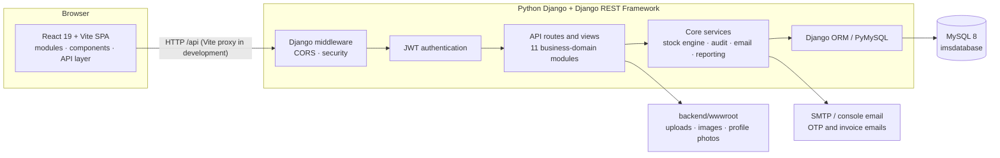
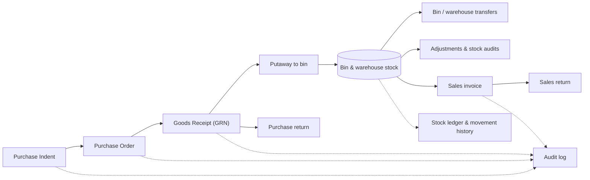

# Enterprise WMS & Inventory Control Hub

A full-stack warehouse and inventory management system that takes stock from **purchase indent → purchase order → goods receipt → bin-level putaway → sales invoicing**, with JWT authentication, audit logging and PDF/Excel reporting. Built with **Python (Django + Django REST Framework)**, **React** and **MySQL**.


**At a glance:** 200+ REST routes · 76 data models · 14 frontend modules · JWT with refresh-token rotation · email OTP verification · audit trail · stock ledger · PDF & Excel exports · 4 automated API tests

---

## Contents
- [Screenshots](#screenshots)
- [Features](#features)
- [Tech stack](#tech-stack)
- [Architecture](#architecture)
- [Project structure](#project-structure)
- [Getting started](#getting-started)
- [Signing in](#signing-in)
- [API overview](#api-overview)
- [Tests](#tests)
- [Known limitations and roadmap](#known-limitations-and-roadmap)
- [Author](#author)

---

## Screenshots 
| Landing Page | Operations Dashboard ||---|---||  |
 |
| Product Catalogue | User & Role Administration ||---|---||  |
 
| The UI is dark by default, with a light theme toggle in the header. The screenshots show a freshly seeded database, so stock, sales, and purchase figures start at zero. ---

## Features

### Authentication & security
- **JWT access tokens with refresh-token rotation** (a refresh issues a new token and revokes the old one)
- **bcrypt** password hashing
- **Email OTP verification** at registration and **password reset by OTP**
- **Optional OTP login**, switched on or off through system settings
- **Account lockout**: 5 failed attempts lock the account for 15 minutes
- Login history and "log out of all devices"
- Configurable CORS origins and environment-based secrets

### Users, roles & audit trail
- User and role administration, with a per-module permission matrix (view / add / edit / delete)
- Clone, reset and update role permissions from the admin screens
- **Audit logs** covering administrative and inventory activity

### Procurement
- **Purchase indents** with an approve / reject workflow
- **Purchase orders** and **goods receipts (GRN)**
- **Purchase returns**
- Supplier master data, supplier documents and supplier payments

### Warehouse operations
- Multi-warehouse setup with **racks and bins**
- **Putaway** into bins with bin-level stock tracking
- **Bin transfers** and **warehouse-to-warehouse stock transfers**
- **Stock adjustments** and **stock audits**
- **Stock ledger** and **stock movement** history for traceability

### Catalogue
- Products and **variants with configurable attributes**
- Categories, sub-categories, brands and units of measure
- **Barcode number generation** per product, and product image uploads

### Sales & billing
- **Sales invoices** with **PDF download** and **email delivery**, plus invoice cancellation that restores stock
- **Sales returns**
- Customer records and customer payments
- Tax and billing settings

### Dashboard & reporting
- KPI cards, **Recharts** sales and purchase charts, recent activity and low-stock insights
- **Sales and stock reports** with **Excel (openpyxl)** and **PDF (ReportLab)** export
- Global search across operational records
- In-app notifications

### Platform
- **Django REST Framework** JSON API with a consistent response format
- MySQL through **PyMySQL**, plus a **zero-setup SQLite mode** for quick local trials
- Environment-based configuration, console or SMTP email, and a health-check endpoint at `/api/health`
- Management commands to create an administrator (`createadmin`) and load the sample data (`load_dump`)
- Django test suite for the core flows

---

## Tech stack

| Layer | Technology |
|---|---|
| **Frontend** | React 19, Vite 8, React Router 7, Recharts, React Select, Lucide icons, jsPDF + AutoTable |
| **Backend** | Python 3.10+, Django 5, Django REST Framework |
| **Database** | MySQL 8.0+ with PyMySQL (SQLite for quick trials) |
| **Auth** | JWT (PyJWT), refresh tokens, bcrypt, email OTP |
| **Documents** | ReportLab (PDF), openpyxl (Excel) |
| **Email** | Django email backend (SMTP, or console in development) |
| **API plumbing** | django-cors-headers |
| **Testing** | Django `TestCase` |

---

## Architecture



### Core business flow



**Design notes**
- The frontend talks to Django through `/api`. In development, Vite proxies `/api`, `/uploads` and `/images` to the Django server.
- Routes and views are organized by business area (admin, auth, masters, parties, products, purchasing, sales, stock operations, reports, system, warehouses), with shared authentication, stock, audit and response logic in `api/core/`.
- Inventory-changing operations (receipts, invoices, returns, transfers, adjustments) go through a **shared stock engine** that updates stock, ledger and movement records together, inside database transactions.
- The Django models mirror the existing MySQL schema, and API paths follow the original application's conventions so the React frontend works unchanged. **Do not run schema migrations against an imported database without a backup.**

---

## Project structure

```text
Enterprise-WMS-Inventory-Control-Hub/
├── backend/                         # Python Django + DRF API
│   ├── manage.py
│   ├── requirements.txt
│   ├── .env.example                 # Environment configuration template
│   ├── ims_backend/                 # Django settings, root URLs, WSGI/ASGI
│   ├── api/
│   │   ├── models.py                # 76 models mirroring the MySQL schema
│   │   ├── urls.py                  # REST API routes
│   │   ├── core/                    # JWT auth, stock engine, audit, email, response helpers
│   │   ├── views/                   # Business-domain API views
│   │   ├── management/commands/     # createadmin, load_dump
│   │   └── tests.py                 # API tests
│   ├── tools/                       # Development utilities
│   └── wwwroot/                     # Uploaded product images, documents, profile photos
├── frontend/                        # React 19 + Vite SPA
│   ├── src/modules/                 # Auth, Dashboard, Inventory, Suppliers, Customers, Warehouses,
│   │                                #   Sales, Payments, Accounting, Reports, Administration, ...
│   ├── src/components/              # Shared UI components
│   ├── src/api/                     # Frontend API client
│   └── vite.config.js               # Dev server and Django API proxy
├── database/
│   └── imsdatabase.sql              # MySQL schema and sample data
├── docs/screenshots/                # README images
└── README.md
```

---

## Getting started

### Prerequisites
- [Python](https://www.python.org/downloads/) 3.10+ (3.11 or 3.12 recommended)
- [Node.js](https://nodejs.org/) 20.19+ or 22.12+ (required by Vite 8)
- [MySQL Server](https://dev.mysql.com/downloads/) 8.0+ (optional if you use the SQLite quick trial below)
- Git and a terminal (commands below are for Windows Command Prompt)

### 1. Clone the repository
```cmd
git clone https://github.com/Harinath2112/Enterprise-WMS-Inventory-Control-Hub.git
cd Enterprise-WMS-Inventory-Control-Hub
```

### 2. Create the database

**Option A: MySQL (recommended)**

Import the dump with MySQL Workbench (**Server → Data Import → Import from Self-Contained File**, choose `database/imsdatabase.sql`), or from the project root:

```cmd
mysql -u root -p < database\imsdatabase.sql
```

Check it worked:

```sql
SHOW DATABASES;
USE imsdatabase;
SHOW TABLES;
```

> If `imsdatabase` already contains real records, do not re-import the dump over it. Back up first.

**Option B: SQLite quick trial (no MySQL needed)**

After step 3 below, set `DB_ENGINE=sqlite` in `backend/.env`, then from `backend/` with the virtual environment active:

```cmd
python manage.py migrate --run-syncdb
python manage.py load_dump "..\database\imsdatabase.sql"
```

### 3. Configure the backend

```cmd
cd backend
python -m venv venv
venv\Scripts\activate
python -m pip install -r requirements.txt
copy .env.example .env
```

Edit `backend/.env` with your local values:

```ini
DB_ENGINE=mysql
DB_NAME=imsdatabase
DB_USER=root
DB_PASSWORD=YOUR_MYSQL_PASSWORD
DB_HOST=127.0.0.1
DB_PORT=3306

DJANGO_SECRET_KEY=REPLACE_WITH_A_LONG_RANDOM_SECRET
DJANGO_DEBUG=1
JWT_KEY=REPLACE_WITH_A_DIFFERENT_LONG_RANDOM_SECRET
JWT_ISSUER=IMSBackend
JWT_AUDIENCE=IMSUsers
CORS_ORIGINS=http://localhost:5174,http://127.0.0.1:5174
```

Never commit `.env` or real passwords. Without SMTP settings, OTP and invoice emails are printed in the Django terminal.

### 4. Run the backend
```cmd
python manage.py check
python manage.py runserver 8000
```
The API runs at **http://localhost:8000**. Check **http://localhost:8000/api/health**; a healthy server returns HTTP `200`. A `404` at `http://localhost:8000/` is normal: Django serves the API and React serves the website.

### 5. Run the frontend
In a second terminal, from the project root:

```cmd
cd frontend
copy .env.example .env
npm install
npm run dev
```

The frontend `.env` should contain:

```ini
VITE_API_BASE_URL=/api
VITE_API_PROXY_TARGET=http://localhost:8000
```

Open **http://localhost:5174**.

For later runs, start MySQL, then run `venv\Scripts\activate` and `python manage.py runserver 8000` in `backend/`, and `npm run dev` in `frontend/`.

---

## Signing in

No shared demo credentials are published. Create your own administrator (this also resets the password if the email already exists):

```cmd
python manage.py createadmin --email you@example.com --password "CHOOSE_A_STRONG_PASSWORD" --name "Your Name"
```

Run it from `backend/` with the virtual environment active and the database configured. Then sign in at http://localhost:5174. Change any seeded password from the sample data before using the app beyond local development.

---

## API overview

The Django backend exposes REST endpoints under `/api`, defined in `backend/api/urls.py`. There is no built-in Swagger UI. Health check: `http://localhost:8000/api/health`.

| Area | Examples |
|---|---|
| Auth | register, login, verify-otp, refresh-token, forgot / reset password, logout, logout from all devices |
| Admin | users, roles, permissions, audit logs, login history, system settings |
| Masters | products, variants, attributes, categories, brands, units, suppliers, customers |
| Procurement | purchase indents (approve / reject), purchase orders, goods receipts, purchase returns |
| Warehouse | warehouses, racks, bins, putaway, bin / stock transfers, adjustments, audits, ledger |
| Sales | invoices (PDF, send by email, cancel), sales returns, customer and supplier payments |
| Reports | dashboard, sales and stock reports, Excel / PDF export, search, barcodes, notifications |

---

## Tests

```cmd
python manage.py test
```

The suite covers: login rejection for a wrong password, authentication required on protected routes, the full purchase → goods receipt → invoice → cancel flow with stock checks, and duplicate-SKU rejection.

---

## Known limitations and roadmap

- **Enforce the permission matrix on the server.** Today the API requires authentication, and the role–permission matrix controls which screens and actions the UI exposes. Adding per-endpoint checks, with tests, is the top priority.
- **Barcode and QR images.** The app generates and stores barcode numbers; rendering barcode and QR images (the `qrcode` and `python-barcode` libraries) is not wired up yet.
- **Concurrency.** Add row-level locking to stock updates so simultaneous sales cannot oversell.
- **API documentation.** Add an OpenAPI schema and Swagger UI (for example with drf-spectacular).
- **More tests and CI.** Expand coverage for stock, financial and authentication flows, and run checks on every push with GitHub Actions.
- **One-command setup.** Docker Compose for Django, React and MySQL.
- **Live demo.** Deploy the stack with seeded sample data and a read-only demo account.
- **Hardening for deployment.** `DEBUG` off, strict `ALLOWED_HOSTS`, HTTPS, rate limits and controlled media access.

---

## Author

**Harinath Kurapati** · B.Tech (CSE – Data Science), CMR College of Engineering & Technology

[Portfolio](https://harinath-ai-spark.lovable.app) · [LinkedIn](https://www.linkedin.com/in/harinathkurapati/) · [GitHub](https://github.com/Harinath2112)
