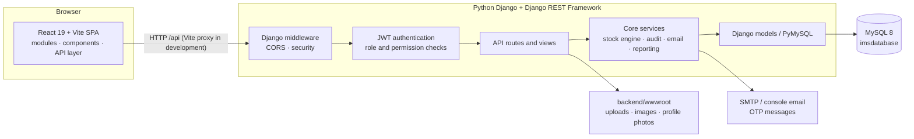
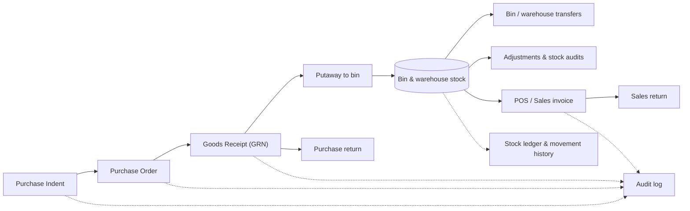

# Enterprise WMS & Inventory Control Hub

A full-stack warehouse and inventory management system that takes stock from **purchase request → purchase order → goods receipt → bin-level putaway → sales / POS**, with role-based access control, audit logging and PDF/Excel reporting. Built with **Python Django + Django REST Framework**, **React**, and **MySQL**.


**At a glance:** Django REST API · MySQL-backed inventory data · permission-based RBAC · OTP email verification · audit trail · barcode/QR generation · PDF & Excel exports

---

## Contents
- [Screenshots](#screenshots)
- [Features](#features)
- [Tech stack](#tech-stack)
- [Architecture](#architecture)
- [Project structure](#project-structure)
- [Getting started](#getting-started)
- [Demo access](#demo-access)
- [API documentation](#api-documentation)
- [What I'd improve next](#what-id-improve-next)
- [Author](#author)

---

## Screenshots

| Landing page | Operations dashboard |
|---|---|
|  |  |

| Product catalogue | User & role administration |
|---|---|
|  |  |

> The UI is dark by default, with a light theme toggle in the header. The screenshots show a freshly seeded database, so stock, sales and purchase figures start at zero.

---

## Features

### Authentication & security
- **JWT access and refresh tokens** for authenticated API requests
- **BCrypt** password hashing
- **Email verification and password reset by OTP**
- **Optional OTP-based login** and account lockout after repeated failed attempts
- Login history and log out of all devices
- Configurable CORS origins and environment-based application secrets

### Access control & auditing
- **Permission-based role authorization** enforced by the Django API
- User, role and permission administration, including permission cloning and updates
- **Audit logs** for administrative and inventory activity

### Procurement
- **Purchase Indents** with approval workflows
- **Purchase Orders** and purchase-order line items
- **Goods Receipts (GRN)** for received stock
- **Purchase Returns**
- Supplier master data, documents and payments

### Warehouse operations
- Multi-warehouse management with **racks and bins**
- **Putaway** and bin-level stock tracking
- **Bin transfers** and **warehouse stock transfers**
- **Stock adjustments** and **stock audits**
- **Stock ledger** and **stock movement** history for traceability

### Catalogue
- Products and **product variants** with configurable attributes
- Categories, sub-categories, brands and units of measure
- **Barcode and QR code generation** with Python libraries
- Product image uploads

### Sales & billing
- **POS** and **sales invoices**
- **Sales returns**
- Customer records, payments and transaction history
- Tax and billing configuration

### Dashboard & reporting
- KPI cards, sales and purchase charts, activity and low-stock insights
- Search across operational records
- **PDF reports** using ReportLab and **Excel exports** using openpyxl
- In-app notifications

### Platform
- **Django REST Framework** API with JSON responses
- MySQL integration through **PyMySQL**
- Django environment configuration and console/SMTP email support
- Health-check endpoint at `/api/health`
- Vite development proxy for `/api`, `/uploads`, and `/images`
- Django test runner

---

## Tech stack

| Layer | Technology |
|---|---|
| **Frontend** | React 19, Vite 8, React Router 7, Recharts, React Select, Lucide icons, jsPDF + AutoTable |
| **Backend** | Python 3.10+, Django 5, Django REST Framework |
| **Database** | MySQL 8.0+ with PyMySQL |
| **Auth** | JWT (PyJWT), refresh tokens, bcrypt, email OTP |
| **Documents & codes** | ReportLab (PDF), openpyxl (Excel), python-barcode, qrcode + Pillow |
| **Email** | Django email backend (SMTP or console in development) |
| **CORS & API** | django-cors-headers, Django REST Framework |

---

## Architecture



### Core business flow



**Design notes**
- The frontend communicates with Django through `/api` endpoints. During development, Vite forwards API and uploaded-media requests to the Django server.
- The Django backend organizes routes and views by business area, with shared authentication, permission, stock, audit and response logic in `api/core/`.
- Inventory-changing operations use a shared stock engine to maintain stock, ledger and movement records together.
- Existing MySQL schema tables are represented by Django models; **do not run schema migrations blindly against an imported production database**.

---

## Project structure

```text
Enterprise-WMS-Inventory-Control-Hub/
├── backend/                         # Python Django + DRF API
│   ├── manage.py                     # Django management entry point
│   ├── requirements.txt              # Python dependencies
│   ├── .env.example                  # Environment configuration template
│   ├── ims_backend/                  # Django settings, root URLs, WSGI/ASGI
│   ├── api/
│   │   ├── models.py                 # MySQL schema models
│   │   ├── urls.py                   # REST API routes
│   │   ├── core/                     # Authentication, permissions, stock, audit, email
│   │   └── views/                    # Business-domain API views
│   ├── tools/                        # Development utilities
│   └── wwwroot/                      # Uploaded product images, documents, profile photos
├── frontend/                        # React 19 + Vite SPA
│   ├── src/modules/                 # Auth, Dashboard, Inventory, Suppliers, Customers,
│   │                                # Warehouses, POS, Payments, Accounting, Reports, Admin
│   ├── src/components/              # Shared UI components
│   ├── src/api/                     # Frontend API client
│   ├── vite.config.js               # Dev server and Django API proxy
│   └── package.json                 # Frontend scripts and dependencies
├── database/
│   └── imsdatabase.sql              # MySQL schema and sample data (if included)
├── docs/screenshots/                # README images (unchanged paths)
└── README.md
```

> Uploaded media is served by Django from `backend/wwwroot/`. Keep existing uploaded files when moving or redeploying the project. The `docs/screenshots/` links above are intentionally unchanged.

---

## Getting started

### Prerequisites
- [Python](https://www.python.org/downloads/) 3.10+ (Python 3.11 or 3.12 recommended)
- [Node.js](https://nodejs.org/) 20.19+ or 22.12+ (compatible with Vite 8)
- [MySQL Server](https://dev.mysql.com/downloads/) 8.0+ and optionally MySQL Workbench
- Git and a terminal (Windows Command Prompt commands below)

### 1. Clone the repository

```cmd
git clone https://github.com/Harinath2112/Enterprise-WMS-Inventory-Control-Hub.git
cd Enterprise-WMS-Inventory-Control-Hub
```

### 2. Create the database

In **MySQL Workbench**, connect to your MySQL server and use **Server → Data Import → Import from Self-Contained File**. Select `database/imsdatabase.sql`, if present in your checkout, and start the import. The provided SQL dump creates the `imsdatabase` database and includes sample administrator/product data.

Alternatively, from Command Prompt in the project root:

```cmd
mysql -u root -p < database\imsdatabase.sql
```

Verify in MySQL Workbench:

```sql
SHOW DATABASES;
USE imsdatabase;
SHOW TABLES;
```

> **Existing data:** If `imsdatabase` already contains your real records, do not reimport the SQL dump over it. Back up the database before any schema changes. A SQL dump containing real data should not be committed to a public repository.

### 3. Configure the backend

Open **Terminal 1** in the project root:

```cmd
cd backend
python -m venv venv
venv\Scripts\activate
python -m pip install -r requirements.txt
copy .env.example .env
```

Edit `backend/.env` and set your local database credentials and secure secret keys. Keep any additional values provided in `.env.example`:

```ini
DB_ENGINE=mysql
DB_NAME=imsdatabase
DB_USER=root
DB_PASSWORD=YOUR_MYSQL_PASSWORD
DB_HOST=127.0.0.1
DB_PORT=3306

DJANGO_SECRET_KEY=REPLACE_WITH_A_LONG_RANDOM_SECRET
DJANGO_DEBUG=1
JWT_KEY=REPLACE_WITH_A_DIFFERENT_LONG_RANDOM_SECRET
JWT_ISSUER=IMSBackend
JWT_AUDIENCE=IMSUsers
CORS_ORIGINS=http://localhost:5174,http://127.0.0.1:5174
```

Never commit `.env` or real passwords to GitHub. Without SMTP settings, development OTP emails are printed in the Django terminal.

### 4. Run the backend

From the activated virtual environment in `backend/`:

```cmd
python manage.py check
python manage.py runserver 8000
```

The Django API runs at **http://localhost:8000**. Test it at **http://localhost:8000/api/health**; a successful request returns HTTP `200` with a healthy status response.

To verify MySQL connectivity separately, use another backend terminal with the virtual environment activated:

```cmd
python manage.py shell -c "from django.db import connection; connection.ensure_connection(); print('MySQL connected successfully')"
```

A `404` at `http://localhost:8000/` is normal: Django serves the API, while React serves the website. Do not run `migrate --run-syncdb` against an existing imported database without reviewing the schema and making a backup.

### 5. Run the frontend

Open **Terminal 2** in the project root:

```cmd
cd frontend
copy .env.example .env
npm install
npm run dev
```

The frontend environment file should contain:

```ini
VITE_API_BASE_URL=/api
VITE_API_PROXY_TARGET=http://localhost:8000
```

Open **http://localhost:5174**. Vite proxies `/api`, `/uploads`, and `/images` requests to Django on port `8000`.

For subsequent local runs, start MySQL, run `venv\Scripts\activate` and `python manage.py runserver 8000` inside `backend/`, then run `npm run dev` inside `frontend/`.

### 6. Sign in

Use the administrator account supplied with your imported sample database, or create/reset an administrator using the project's management command:

```cmd
python manage.py createadmin --email you@example.com --password "CHOOSE_A_STRONG_UNIQUE_PASSWORD"
```

Run that command from `backend/` with the virtual environment active and a configured database connection. Change any seeded/demo password before using the application beyond local development. With no SMTP server configured, OTP messages are printed in the Django backend terminal during development.

---

## Demo access

| Role | Email | Password |
|---|---|---|
| Administrator | `<demo-admin-email>` | `<demo-admin-password>` |

Use the administrator account created or imported into your local database. Credentials are intentionally not published in this README. From the administration screens, manage users, roles and their permissions.

---

## API documentation

The Django backend exposes REST endpoints under `/api`. **Health check:** [`http://localhost:8000/api/health`](http://localhost:8000/api/health). Unlike the previous ASP.NET Core version, this project does **not** include a built-in Swagger UI at `/swagger`.

| Area | Examples |
|---|---|
| Auth | register, login, verify-otp, refresh-token, forgot / reset password, logout |
| Admin | users, roles, permissions, audit logs, login history, system settings |
| Masters | products, variants, attributes, categories, brands, units, suppliers, customers |
| Procurement | purchase indents, purchase orders, goods receipts, purchase returns |
| Warehouse | warehouses, racks, bins, putaway, stock transfers, adjustments, audits, ledger |
| Sales | invoices, sales returns, customer payments, POS |
| Reports | dashboard, reports, PDF / Excel export, search, barcodes |

The route definitions are maintained in `backend/api/urls.py`. Many routes intentionally preserve the earlier application's API paths for frontend compatibility.

---

## What I'd improve next

- **Automated tests**: expand Django tests for stock movement, permissions, authentication and financial workflows; add React component tests
- **CI/CD**: GitHub Actions to run Django checks/tests and frontend lint/build on each push
- **One-command setup**: Docker Compose for Django, React and MySQL
- **Live demo**: deploy the stack and provide a read-only demonstration account
- **Richer seed data**: sample suppliers, customers, receipts and invoices for realistic dashboards
- **Hardening**: stronger deployment settings, HTTPS, rate limits, secure secrets and controlled media access
- **Operational alerts**: scheduled low-stock and expiry notifications by email

---

## Author

**Harinath Kurapati** · B.Tech (CSD), CMR College of Engineering & Technology

[Portfolio](https://harinath-ai-spark.lovable.app) · [LinkedIn](https://www.linkedin.com/in/harinathkurapati/) · [GitHub](https://github.com/Harinath2112)
